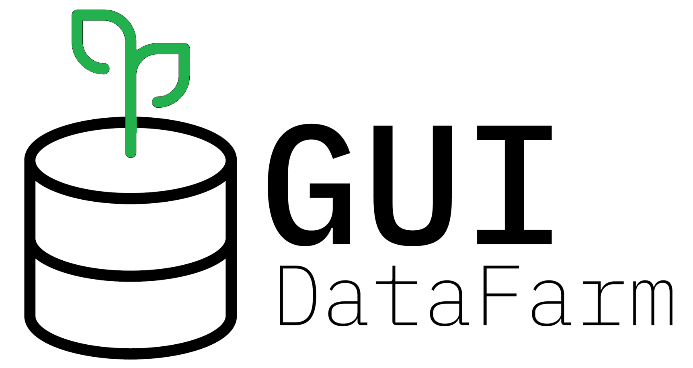

# GUIDataFarm

DataFarm is an innovative framework for efficiently generating and labeling large query workloads. 
It follows a data-driven & white-box approach to learn from pre-existing small workload patterns, input data, and computational resources. 
Thus, DataFarm allows users to produce a large heterogeneous set of realistic jobs with their labels, which can be used by any ML-based data management component.
````
@INPROCEEDINGS{vandewaterFarmingYourMLbased2022,
  author={Van De Water, Robin and Ventura, Francesco and Kaoudi, Zoi and Quiané-Ruiz, Jorge-Arnulfo and Markl, Volker},
  booktitle={2022 IEEE 38th International Conference on Data Engineering (ICDE)}, 
  title={Farming Your ML-based Query Optimizer's Food}, 
  year={2022},
  volume={},
  number={},
  pages={3186-3189},
  doi={10.1109/ICDE53745.2022.00294}}
````
## Requirements

- SBT >= 1.3 
- Scala == 2.11
- Flink == 1.10.0
- Python == 3.6

Install all the python requirements specified in `requirements.txt`.  
N.B. DtaFarm has been tested on Linux and MacOS.

## Quick-start

1. Update `CONFIG.py`
2. Update `TableMetaData.py` (if needed)
3. Run `RunGenerator.py` 
4. Run `RunLabelForecaster.py`: To submit the jobs it is necessary that a Flink cluster is running. Please, be sure that the cluster is running and accessible.

## Configuration
To configure DataFarm you have to edit the `CONFIG.py`.

Please, provide the following configurations to start generating jobs:

- Provide the absolute path to the DataFarm
    ```Python
    PROJECT_PATH = "/absolute/path/to/DataFarm/project"
    ```

- Provide the absolute path to the folder containing your input data
    ```Python
    GENERATED_JOB_INPUT_DATA_PATH = "/absolute/path/to/input/data" 
    ```
    This folder will contain your input data.
    
- Provide the absolute path to the flink compiled source.
    ```Python
    FLINK_HOME = "/absolute/path/to/flink"
    ```
    N.B. The current version of DataFarm has been tested on Flink 1.10.0 built with scala 2.11. You can download Flink from [here](https://archive.apache.org/dist/flink/flink-1.10.0/flink-1.10.0-bin-scala_2.11.tgz).
    
We provide a sample _Input Workload_ in the project folder `data/input_workload_exec_plan`. 
You can include here any execution plan extracted from Flink jobs.

We also provide a sample TPC-H input data (about 1GB).
You can download sample TPC-H input data from [here](https://www.kaggle.com/fven7u/tpch-1gb).

The provided `TableMetaData.py` already contains the information necessary to run DataFarm with TPC-H data with scale factors 1GB, 5GB, 10GB, 50GB.

### Generator Configuration
DataFarm can be configured to generate datasets with different characteristics:

- `N_JOBS` defines the number of diverse Abstract Plans that will be generated.
- `N_VERSIONS` defined the number of versions that will be generated for each Abstract Plan.
- `JOB_SEED` can be specified to make the generation process replicable. If -1 the generation process is random. Otherwise, if >-1 the system will use the specified seed.
- `DATA_MANAGER` specifies the database manager to be used. The current implementation already implements the TPC-H database manager. You can use it specifying "TPCH".
- `DATA_ID` specifies the id of the input data meta-data that has to be used by the system. The input data meta-data can be specified in `TableMetaData.py`.
- `EXPERIMENT_ID` defines the id of the experiment. It will be the name of the folder where the results of the generation process will be stored.


### Label Forecaster Configuration
The Label Forecaster can be configured with:

- `MAX_EARLY_STOP` defines the max number of early stops that will be computed before interrupting the labeling process.
- `EARLY_STOP_TH` defines the threshold for early stop. It has to be included in the range (0, 1.0).
- `MAX_ITER` defines the maximum number of iterations that will be performed before interrupting the active learning iterations.
- `INIT_JOBS` defines the number of jobs to sample and run before starting the Active Learning process.
- `RANDOM_SAMPLING` defines if the instances will be picked with weighted random sampling based on uncertainty.

## Table Meta-Data
The `TableMetaData` defines all the ER information regarding your db. 
All the information have to be provided through python dictionary.

You should specify the possible join relations that you want to consider while instantiating new jobs.
Also, you should specify, for each table, which are the fields that can be filtered, and grouped.
Finally, you should also specify which are the fields that contains dates.

Then, also the raw cardinalities of the tables under exam should be specified.

To have an example of `TableMetaData` configuration, please look at the `TableMetaData.py` file.
